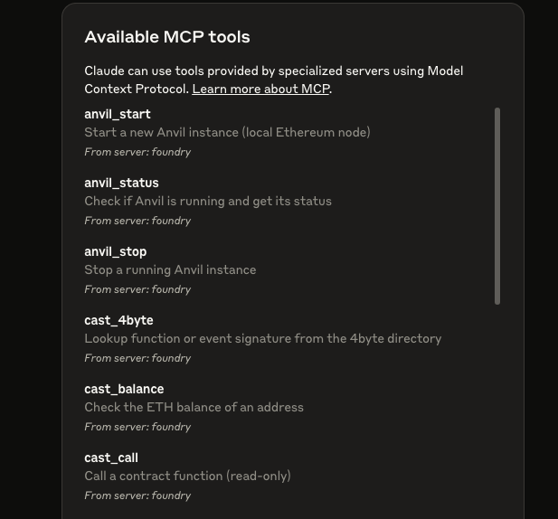

# Foundry MCP Server

A simple, lightweight and fast MCP (Model Context Protocol) server that provides Solidity development capabilities using the Foundry toolchain (Forge, Cast, and Anvil).


## Overview

This server connects LLM assistants to the Foundry ecosystem, enabling them to:

- Interact with nodes (local Anvil instances or remote RPC endpoints)
- Analyze smart contracts and blockchain data
- Perform common EVM operations using Cast
- Manage, deploy, and execute Solidity code and scripts
- Work with a persistent Forge workspace

## Features

### Network Interaction

- Start and manage local Anvil instances
- Connect to any remote network (just specify the RPC)
- Get network/chain information

### Contract Interaction

- Call contract functions (read-only)
- Send transactions to contracts (if `PRIVATE_KEY` is configured)
- Get transaction receipts
- Read contract storage
- Analyze transaction traces
- Retrieve contract ABIs and sources from block explorers

### Solidity Development

- Maintain a dedicated Forge workspace
- Create and edit Solidity files
- Install dependencies
- Run Forge scripts
- Deploy contracts

### Utility Functions

- Calculate contract addresses
- Check contract bytecode size
- Estimate gas costs
- Convert between units (hex to decimals, etc.,)
- Generate wallets
- Get event logs
- Lookup function and event signatures

## Usage

The server is designed to be used as an MCP tool provider for MCP Clients. When connected to a client, it enables the clients(claude desktop, cursor, client, etc.,) to perform Solidity and onchain operations directly.


#### Requirements

- [Node.js v18+](https://nodejs.org)
- [Foundry toolchain](https://book.getfoundry.sh/) (Forge, Cast, Anvil)
  
### Manual Setup

1. Ensure Foundry tools (Forge, Cast, Anvil) are installed on your system:
   ```
   curl -L https://foundry.paradigm.xyz | bash
   foundryup
   ```
2. Clone and build the server.

    ```sh
    bun i && bun build
    ```
   
3. Update your client config (eg: Claude desktop):

```json
 "mcpServers": {
    "foundry": {
      "command": "node",
      "args": [
        "path/to/foundry-mcp-server/dist/index.js"
      ],
      "env" :{
        "PRIVATE_KEY": "0x1234",
      }
    }
 }
```

### Setup using NPM Package
- Coming soon  

#### Configuration

The server supports the following environment variables:

- `RPC_URL`: Default RPC URL to use when none is specified (optional)
- `PRIVATE_KEY`: Private key to use for transactions (optional)

### Workspace

The server maintains a persistent Forge workspace at `~/.mcp-foundry-workspace` for all Solidity files, scripts, and dependencies.

## Tools

### Anvil 

- `anvil_start`: Start a new Anvil instance
- `anvil_stop`: Stop a running Anvil instance
- `anvil_status`: Check if Anvil is running and get its status

### Cast  

- `cast_call`: Call a contract function (read-only)
- `cast_send`: Send a transaction to a contract function
- `cast_balance`: Check the ETH balance of an address
- `cast_receipt`: Get the transaction receipt
- `cast_storage`: Read contract storage at a specific slot
- `cast_run`: Run a published transaction in a local environment
- `cast_logs`: Get logs by signature or topic
- `cast_sig`: Get the selector for a function or event signature
- `cast_4byte`: Lookup function or event signature from the 4byte directory
- `cast_chain`: Get information about the current chain

### Forge

- `forge_script`: Run a Forge script from the workspace
- `install_dependency`: Install a dependency for the Forge workspace

### File Management

- `create_solidity_file`: Create or update a Solidity file in the workspace
- `read_file`: Read the content of a file from the workspace
- `list_files`: List files in the workspace

### Utilities

- `convert_eth_units`: Convert between EVM units (wei, gwei, hex)
- `compute_address`: Compute the address of a contract that would be deployed
- `contract_size`: Get the bytecode size of a deployed contract
- `estimate_gas`: Estimate the gas cost of a transaction

## Usage in Claude Desktop App 🎯

Once the installation is complete, and the Claude desktop app is configured, you must completely close and re-open the Claude desktop app to see the tavily-mcp server. You should see a hammer icon in the bottom left of the app, indicating available MCP tools, you can click on the hammer icon to see more details on the available tools.



Now claude will have complete access to the foundry-mcp server. If you insert the below examples into the Claude desktop app, you should see the foundry-mcp server tools in action.

### Examples

1. **Transaction analysis**:
```
Can you analyze the transaction and explain what it does? 
https://etherscan.io/tx/0xcb73ad3116f19358e2e649d4dc801b7ae0590a47b8bb2e57a8e98b6daa5fb14b
```

2. **Querying Balances**:
```
Query the mainnet ETH and USDT balances for the wallet 0x195F46025a6926968a1b3275822096eB12D97E70.
```
3.  **Sending transactions**:
```
Transfer 0.5 USDC to 0x195F46025a6926968a1b3275822096eB12D97E70 on Mainnet. 
```

4. **Deploying contracts**:
```
Deploy a mock ERC20 contract to a local mainnet forked anvil instance with blocknumber 22230903.
```


## Acknowledgments ✨

- [Model Context Protocol](https://modelcontextprotocol.io) for the MCP specification
- [Anthropic](https://anthropic.com) for Claude Desktop